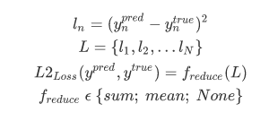

## Formula

## Standard Implementations in ML Frameworks
- [PyTorch: MSE Loss](https://pytorch.org/docs/stable/generated/torch.nn.MSELoss.html)
- [Keras: MeanSquaredError](https://keras.io/api/losses/regression_losses/#meansquarederror-class)
- [TF 2.3: MeanSquaredError](https://www.tensorflow.org/api_docs/python/tf/keras/losses/MeanSquaredError)

## Other Resources
- [Analytics Vidhya Blog](https://www.analyticsvidhya.com/blog/2019/08/detailed-guide-7-loss-functions-machine-learning-python-code/)
- [L1 vs. L2 Loss function](http://rishy.github.io/ml/2015/07/28/l1-vs-l2-loss/)
- [Differences between L1 and L2 as Loss Function and Regularization](http://www.chioka.in/differences-between-l1-and-l2-as-loss-function-and-regularization/)
